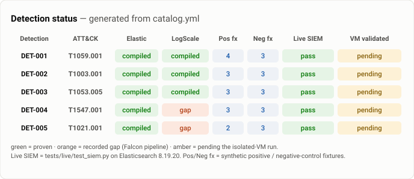
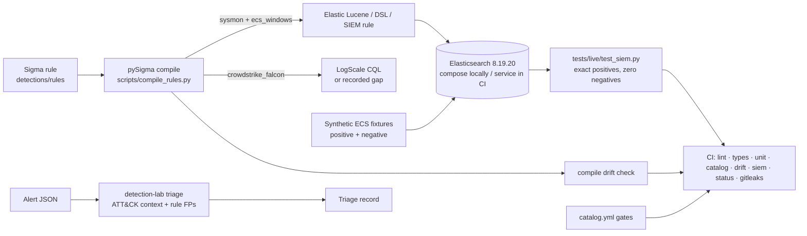

# Detection Engineering Lab

[](https://github.com/nick-bellows/detection-engineering-lab/actions/workflows/quality.yml)

Five behaviour-based Sigma detections, mapped to MITRE ATT&CK, each compiled to **Elastic** and
**CrowdStrike LogScale** and run against a **live Elasticsearch** in CI — with the boundary between
"the query works" and "the telemetry was really generated" kept explicit and machine-enforced.

## Coverage



| ID | ATT&CK | Detection | Elastic | LogScale | Fixtures +/− |
| --- | --- | --- | --- | --- | --- |
| [DET-001](docs/detections/DET-001.md) | T1059.001 | PowerShell with an encoded command, or a hidden window + download cradle | ✅ | ✅ | 4 / 3 |
| [DET-002](docs/detections/DET-002.md) | T1003.001 | LSASS dump via comsvcs `MiniDump` or ProcDump | ✅ | ✅ | 3 / 3 |
| [DET-003](docs/detections/DET-003.md) | T1053.005 | `schtasks /create` as SYSTEM or from a user-writable path / script host | ✅ | ✅ | 3 / 3 |
| [DET-004](docs/detections/DET-004.md) | T1547.001 | Run-key value pointing at a user-writable path or script host | ✅ | gap | 3 / 3 |
| [DET-005](docs/detections/DET-005.md) | T1021.001 | RDP logon (4624 / type 10) from outside the documented jump hosts | ✅ | gap | 2 / 3 |

All five are `fixture-validated`; none is `validated` yet. Each write-up covers data requirements,
the logic in plain language, validation evidence, researched false positives, triage steps, blind
spots, and a hunt note. The status image above is generated from `catalog.yml` and drift-checked in
CI, so it can never quietly disagree with the rules.

## The one boundary that matters

- **`fixture-validated`** (where every rule is): the compiled Elastic query returned exactly its
  positive fixtures and none of the 15 negative controls, on Elasticsearch 8.19.20, in CI
  (`tests/live/test_siem.py`). The fixtures are synthetic, authored from named Atomic Red Team
  command shapes — no third-party telemetry, no payload executed.
- **`validated`** (the next step, not claimed): the Atomic tests run on a real, isolated Windows VM
  and the alert fires on *generated* Sysmon/Security events. Until that happens
  `validate_catalog.py --require-validated` fails, and CI asserts that it fails — the boundary is
  enforced, not just written down.

**LogScale is 3 of 5 on purpose.** The pySigma Falcon pipeline has no mapping for `registry_set`
(DET-004) or Security 4624 (DET-005); rather than commit a query that could never match, the
compiler records the gap. That is what "gap" means in the table.

## How a rule is proven



## Reading this repo (for a reviewer with ten minutes)

1. **`detections/rules/det-001-*.yml`** — a rule in source form; the `falsepositives` and the
   negative-control rationale are the interesting part.
2. **`docs/detections/DET-001.md`** — the same detection written up the way a SOC would document it.
3. **`tests/live/test_siem.py`** — the two tests that carry every claim:
   `test_query_returns_exactly_its_own_positives` (each query hits its positives, no negative) and
   `test_case_variants_depend_on_the_index_mapping` (the case-sensitivity finding, proven both ways).

The decision I would revisit first: the fixtures are synthetic, so this proves the query and field
mapping, not telemetry generation. The isolated-VM run (`telemetry/atomic-test-plan.md`) closes that
gap and is the next piece of work.

## Two findings worth knowing before deploying these queries

1. **Case sensitivity is a deployment property, not a rule property.** Sigma `contains` is
   case-insensitive; the compiled Lucene query is only case-insensitive if the index field is
   lowercase-normalised. The stock Elastic Windows integration maps `process.command_line` as
   `wildcard` (case-sensitive), so `POWERSHELL.EXE -ENC` can slip past a rule that passes review.
   `test_case_variants_depend_on_the_index_mapping` proves both outcomes.
2. **The Falcon pipeline fails quietly** — see the LogScale note above.

Every gate in this repo was watched failing once (a broken rule, a poisoned negative control, a rule
edited without a recompile); `docs/validation-log.md` records the mutation and the result.

## Quick start

```powershell
py -3.13 -m venv .venv
./.venv/Scripts/Activate.ps1
python -m pip install -e ".[dev,detection]"
pytest                                        # unit + contract tests (no SIEM needed)
python scripts/compile_rules.py --check       # committed queries match the rules
python scripts/render_status_svg.py --check   # the status image matches the catalog
python scripts/validate_catalog.py --strict   # every rule >= fixture-validated
detection-lab triage tests/fixtures/alerts/synthetic_alert.json --critical-host LAB-WIN-01
```

Live-SIEM proof (needs Docker):

```powershell
Copy-Item lab/.env.example lab/.env
docker compose -f lab/compose.yml up -d
$env:DETECTION_LAB_ES_URL = "http://127.0.0.1:9200"
$env:DETECTION_LAB_ES_PASSWORD = "lab-only-elastic-password-change-me"   # value from lab/.env
python scripts/wait_for_es.py
pytest -m siem
```

`scripts/run_checks.ps1` runs the whole gate in CI order.

## Map

```text
detections/rules/       Five Sigma rules (one file per technique)
detections/compiled/    pySigma output per target + manifest.json (drift-checked)
detections/catalog.yml  Lifecycle source of truth
docs/DESIGN.md          How the lab is built and gated — lifecycle, compile targets, matrix, enrichment
docs/detections/        One write-up per detection
docs/validation-log.md  The mutation that made each gate fail, and the defects found
docs/future-work.md     Backlog, each item tagged with the job-description line it answers
tests/fixtures/         Synthetic telemetry (+ meta.yml) and a sample alert
tests/live/             Live-SIEM tests (marker `siem`)
lab/                    Compose lab, pinned image digests, fixture index mapping
telemetry/              Validation matrix and the isolated-VM plan (atomic-test-plan.md)
evidence/               Hashed manifest of every artefact the catalog points at
src/detection_lab/      Catalog gates, rule compiler, fixtures loader, enrichment, CLI
scripts/                compile_rules · validate_catalog · build_evidence_manifest · render_status_svg · wait_for_es
```

## Safety and licences

Atomic tests run only inside a disposable, isolated VM controlled by the tester; nothing in this
repository executes a payload — the fixtures are text. Never run the simulations on the host or
against systems you do not own.

MIT licensed. Third-party sources: MITRE ATT&CK (terms of use, attribution), Atomic Red Team (MIT;
command shapes referenced by GUID), Sigma / pySigma (LGPL / MIT), Elastic images (Elastic License).
