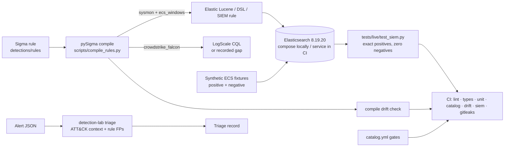

# Detection Engineering Lab

Five Sigma detections, mapped to MITRE ATT&CK, compiled with pySigma to **Elastic** and
**CrowdStrike LogScale**, and proven on a **live Elasticsearch** against synthetic positive and
negative-control fixtures — in CI, on every push. Plus the alert-enrichment step that turns a hit
into an analyst-ready triage record.

> **Status: `fixture-validated`, 5 of 5 rules** (2026-08-29).
> Proven: each compiled Elastic query returns exactly its own positive fixtures and none of the
> 15 negative controls in the corpus, on Elasticsearch 8.19.20 (`tests/live/test_siem.py`, CI job `siem`).
> Compiled to LogScale: **3 of 5** — the pySigma Falcon pipeline has no mapping for `registry_set`
> (DET-004) or Security 4624 (DET-005); both gaps are recorded, not papered over.
> **Not proven:** telemetry generation on a real host. The Atomic Red Team run in an isolated VM is
> the step to `validated`, and the catalog gate for it is asserted to still fail.

## What is here

| ID | ATT&CK | Detection | Elastic | LogScale | Fixtures (+/−) |
| --- | --- | --- | --- | --- | --- |
| [DET-001](docs/detections/DET-001.md) | T1059.001 | PowerShell with an encoded command, or hidden window + download cradle | ✅ | ✅ | 4 / 3 |
| [DET-002](docs/detections/DET-002.md) | T1003.001 | LSASS dump via comsvcs `MiniDump` or ProcDump | ✅ | ✅ | 3 / 3 |
| [DET-003](docs/detections/DET-003.md) | T1053.005 | `schtasks /create` as SYSTEM or from a user-writable path / script host | ✅ | ✅ | 3 / 3 |
| [DET-004](docs/detections/DET-004.md) | T1547.001 | Run-key value pointing at a user-writable path or script host | ✅ | gap | 3 / 3 |
| [DET-005](docs/detections/DET-005.md) | T1021.001 | RDP logon (4624/10) from outside the documented jump hosts | ✅ | gap | 2 / 3 |

Each write-up covers data requirements, logic in plain language, validation evidence, researched
false positives, triage steps, blind spots, and a five-line hunt note.

## How a rule is proven



The compiled queries are committed under `detections/compiled/` and regenerated from the rules;
CI fails if a rule or a pinned backend changes without the compiled text following.

## Quick start

```powershell
py -3.13 -m venv .venv
./.venv/Scripts/Activate.ps1
python -m pip install -e ".[dev,detection]"
pytest                                        # unit + contract tests (no SIEM needed)
python scripts/compile_rules.py --check       # committed queries match the rules
python scripts/validate_catalog.py --strict   # every rule >= fixture-validated
detection-lab triage tests/fixtures/alerts/synthetic_alert.json --critical-host LAB-WIN-01
```

Live-SIEM proof (needs Docker):

```powershell
Copy-Item lab/.env.example lab/.env
docker compose -f lab/compose.yml up -d
$env:DETECTION_LAB_ES_URL = "http://127.0.0.1:9200"
$env:DETECTION_LAB_ES_PASSWORD = "lab-only-elastic-password-change-me"   # value from lab/.env
python scripts/wait_for_es.py
pytest -m siem
```

`scripts/run_checks.ps1` runs the whole gate in the same order as CI.

## Lifecycle and gates

`planned → implemented → fixture-validated → validated → retired` (`detections/README.md`).

- `validate_catalog.py --strict` — every detection is at least `fixture-validated`: rule file,
  both compile targets (or a recorded gap), both fixtures with metadata, a write-up, and a resolved
  ATT&CK version (v19.2, accessed 2026-08-29).
- `validate_catalog.py --require-validated` — every detection has Atomic test IDs and evidence from
  the VM run. **This gate fails today and CI asserts that it does**, so the boundary between
  "the query works" and "the telemetry was generated" cannot be erased by accident.

## Findings worth knowing before deploying these queries

1. **Case sensitivity is a deployment property.** Sigma `contains` is case-insensitive; the
   compiled Lucene query is only case-insensitive when the index field is lowercase-normalised.
   The lab mapping does that; the stock Elastic Windows integration maps `process.command_line` as
   `wildcard` (case-sensitive). `test_case_variants_depend_on_the_index_mapping` proves both
   outcomes with uppercase `-ENC` and `/Create` fixtures. See DET-001, Blind spots.
2. **The Falcon pipeline does not fail loudly.** For logsources it cannot map it passes Windows
   field names through untouched. The compiler treats a query without `#event_simpleName` as
   unsupported (`detections/compiled/manifest.json`).
3. **Every gate was watched failing once** — a broken rule, a poisoned negative control, and a rule
   edit without a recompile each turned the right check red (`docs/validation-log.md`).

## Fixtures are synthetic, and say so

`tests/fixtures/telemetry/DET-00N/{positive,negative}.ndjson` are ECS-shaped documents authored
from the command shapes of named Atomic Red Team tests (GUIDs and access dates in each `meta.yml`).
No third-party telemetry was copied, no Atomic payload was executed, and every document carries
`labels.synthetic: true`. Negative controls are near-misses on purpose: ProcDump of a different
process, an AppData path under a non-Run key, RDP from the jump host.

## Enrichment

`detection-lab triage <alert.json>` validates the alert against `automation/triage-contract.json`
and prints a record with a transparent priority score, the ATT&CK technique context (name, tactics,
URL, version), and the rule's own `falsepositives` list so the analyst sees what the author already
expected to be noisy. No automated response action is taken.

## Repository map

```text
detections/rules/       Five Sigma rules (one file per technique)
detections/compiled/    pySigma output per target + manifest.json (drift-checked)
detections/catalog.yml  Lifecycle source of truth
tests/fixtures/         Synthetic telemetry (+ meta.yml) and a sample alert
tests/live/             Live-SIEM tests (marker `siem`)
lab/                    Compose lab, pinned image digests, fixture index mapping
docs/detections/        One write-up per detection
docs/validation-log.md  Mutations that made each gate fail, and the defects found
docs/future-work.md     Backlog, each item tagged with the job-description line it answers
evidence/               Hashed manifest of every artefact the catalog points at
telemetry/              Validation matrix (fixture columns filled, VM columns not) and Atomic plan
src/detection_lab/      catalog gates, rule compiler, fixtures loader, enrichment, CLI
scripts/                compile_rules, validate_catalog, build_evidence_manifest, wait_for_es
```

## Path to `validated`

Run the five Atomic tests on a disposable, isolated Windows VM with Sysmon; ship the events to the
lab Elasticsearch; export, sanitise and hash them into `evidence/`; fill the VM columns of
`telemetry/validation-matrix.csv` and the `positive_test_id`/`negative_test_id`/`evidence_ids`
fields in the catalog. `--require-validated` then passes and the CI step that asserts its failure
is removed in the same commit. `ml/` (an authentication-anomaly baseline) stays `planned` until then.

## Safety

Atomic tests run only inside a disposable, isolated VM controlled by the tester. Nothing in this
repository executes a payload; the fixtures are text. Never run the simulations on the host or
against systems you do not own.

MIT licensed. Third-party sources: MITRE ATT&CK (terms of use, attribution), Atomic Red Team (MIT,
command shapes referenced by GUID), Sigma / pySigma (LGPL / MIT), Elastic images (Elastic License).
